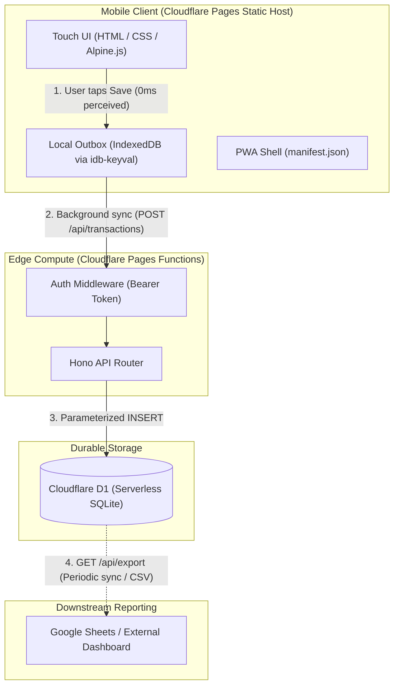

# SnapTally Architecture and Design

This document details the architectural choices, data flow, storage strategies, and operational parameters for SnapTally.

## System Overview

SnapTally is an expense intake tool engineered for quick data entry at the point of sale. Rather than loading a complex spreadsheet or multi-screen budgeting platform on mobile, SnapTally restricts the intake scope to a fast PWA form with offline support.



## Core Design Principles

1. **Sub-5-Second Point of Sale Logging**: Tapping native dropdowns triggers slow platform pickers. SnapTally uses single-tap pill buttons for cards and parent categories, updating subcategories dynamically in memory.
2. **Offline-First Resilience**: Bad network reception at grocery checkouts or basements must not block entry. Submissions persist immediately to client storage and synchronize when the network is reachable.
3. **Zero-Maintenance Infrastructure**: Serverless edge hosting and serverless relational storage remove OS patching, VPS maintenance, and container upkeep.
4. **Separation of Intake from Analysis**: Dashboards, aggregate formulas, and trend reports remain in spreadsheets or reporting tools. SnapTally is strictly an intake and ledger engine.

## Client Layer

### Touch-Friendly UI
- **Pill Chips**: Cards and categories render as tap targets styled for thumb reaches.
- **Dynamic Dependent Chips**: Selecting a parent category (for example, Fixed, Variable, or Guilt-Free) updates the visible subcategories in client state via Alpine.js without network roundtrips.
- **PWA Manifest**: Configured with `display: standalone` and iOS touch icons to run without browser chrome, URL bars, or bottom navigation strips.

### Optimistic Outbox Flow
The application uses IndexedDB (wrapped by `idb-keyval`) to implement an optimistic outbox:

1. The user taps **Save**.
2. The transaction record is written to the local IndexedDB outbox with a client-generated UUID and timestamp.
3. The UI resets the input fields immediately and provides instant feedback.
4. An asynchronous sync handler attempts to flush the queue via `POST /api/transactions`.
5. Upon receiving an HTTP 201 response, the record is removed from IndexedDB.
6. If the device is offline or the network fails, items remain queued in IndexedDB until connectivity restores or the app is reopened.

## Compute Layer (Cloudflare Pages Functions + Hono)

Cloudflare Pages Functions provide the serverless backend without needing an independent Workers project.

- **Hono Router**: Runs on the V8 isolate environment (`workerd`) using web standards (`Request` and `Response`). Hono adds structured routing, typed bindings, and lightweight middleware in under 15 KB.
- **Native D1 Binding**: The database is bound directly to the environment context (`c.env.DB`), allowing parameterized SQL execution without external network database drivers.
- **Authentication**: Ingress is guarded by a lightweight bearer token check. The client stores a pre-shared token in local storage and sends it via the `Authorization: Bearer <TOKEN>` header.

## Database Layer (Cloudflare D1)

Cloudflare D1 acts as the primary relational system of record.

### Transaction Schema

```sql
CREATE TABLE IF NOT EXISTS transactions (
    id TEXT PRIMARY KEY,
    date TEXT NOT NULL,
    card TEXT NOT NULL,
    parent_bucket TEXT NOT NULL,
    subcategory TEXT NOT NULL,
    merchant TEXT NOT NULL,
    gross_amount REAL NOT NULL,
    reimbursement REAL DEFAULT 0,
    net_spend REAL NOT NULL,
    created_at DATETIME DEFAULT CURRENT_TIMESTAMP
);

CREATE INDEX IF NOT EXISTS idx_transactions_date ON transactions(date);
```

### Net Spend Calculation
Transactions track both `gross_amount` and `reimbursement`. `net_spend` is computed as `gross_amount - reimbursement` prior to storage, allowing direct aggregation on net out-of-pocket costs.

## Downstream Reconciliation & Google Sheets Integration

SnapTally provides an export endpoint (`GET /api/export`) returning JSON or CSV data. This allows:

1. **Periodic Scripted Pull**: A lightweight Google Apps Script running inside Google Sheets can fetch `/api/export` on a schedule and append new records into a raw Transactions tab.
2. **Manual Reconciliation**: Ad-hoc CSV downloads can be imported into monthly spreadsheets for macro budgeting and formula analysis.

## Free Tier Operational Capacity

Cloudflare free tier allotments provide substantial headroom for personal budget tracking:

| Resource | Allotment | SnapTally Usage Profile |
| :--- | :--- | :--- |
| Pages Hosting & Bandwidth | Unlimited | Static assets served from global edge cache |
| Pages Functions Requests | 100,000 requests / day | Far exceeds personal daily transaction volume |
| D1 Database Size | 500 MB / database | Accommodates roughly 1.5 to 2 million records |
| D1 Row Writes | 100,000 writes / day | Point-of-sale entries rarely exceed dozens per day |
| D1 Row Reads | 5,000,000 reads / day | Recent feed and periodic exports stay well under cap |
| Inactivity Policy | No idle pauses or deletions | Data remains intact without periodic pinging |

## Phased Implementation Roadmap

1. **Phase 1 (Proof of Concept)**: Unstyled HTML form, single POST endpoint in Pages Functions, local D1 table verification via Wrangler.
2. **Phase 2 (MVP Intake PWA)**: Alpine.js pill chips, touch styling, PWA manifest, IndexedDB outbox queue, pre-shared token authentication, recent transaction list.
3. **Phase 3 (Modular CRUD & Tooling)**: Modular Hono routers for categories and accounts, Drizzle ORM for type-safe queries and schema migrations, and Google Sheets sync automation.
