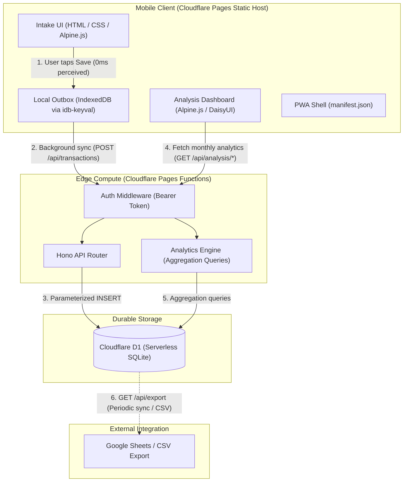

# SnapTally Architecture and Design

This document details the architectural choices, data flow, storage strategies, and operational parameters for SnapTally.

## System Overview

SnapTally provides a unified personal finance platform focused on rapid point-of-sale intake and planned Conscious Spending Plan budget analysis. The system combines an ultra-fast, fixed-viewport intake PWA with serverless edge analytics backed by Cloudflare D1.


```mermaid
flowchart TD
    subgraph MobileClient["Mobile Client (Cloudflare Pages Static Host)"]
        UI["Intake UI (HTML / CSS / Alpine.js)"]
        Dashboard["Analysis Dashboard (Alpine.js / DaisyUI)"]
        Outbox["Local Outbox (IndexedDB via idb-keyval)"]
        PWA["PWA Shell (manifest.json)"]
    end

    subgraph EdgeCompute["Edge Compute (Cloudflare Pages Functions)"]
        Auth["Auth Middleware (Bearer Token)"]
        Router["Hono API Router"]
        AnalyticsEngine["Analytics Engine (Aggregation Queries)"]
    end

    subgraph EdgeStorage["Durable Storage"]
        D1[("Cloudflare D1 (Serverless SQLite)")]
    end

    subgraph MacroReporting["External Integration"]
        Sheets["Google Sheets / CSV Export"]
    end

    UI -->|"1. User taps Save (0ms perceived)"| Outbox
    Outbox -->|"2. Background sync (POST /api/transactions)"| Auth
    Auth --> Router
    Router -->|"3. Parameterized INSERT"| D1
    Dashboard -->|"4. Fetch monthly analytics (GET /api/analysis/*)"| Auth
    Auth --> AnalyticsEngine
    AnalyticsEngine -->|"5. Aggregation queries"| D1
    D1 -.->|"6. GET /api/export (Periodic sync / CSV)"| Sheets
```

## Core Design Principles

1. **Sub-5-Second Point of Sale Logging**: Tapping native dropdowns triggers slow platform pickers. SnapTally uses single-tap pill buttons for cards and parent categories, updating subcategories dynamically in memory.
2. **Offline-First Resilience**: Bad network reception at checkout counters or basements must not block entry. Submissions persist immediately to client storage and synchronize when the network is reachable.
3. **Zero-Maintenance Infrastructure**: Serverless edge hosting and serverless relational storage remove OS patching, VPS maintenance, and container upkeep.
4. **Intake Speed Protection with Dedicated Edge Analysis**: While SnapTally plans integrated monthly Conscious Spending Plan analysis and sinking fund tracking, the primary intake viewport remains strictly decoupled from analytical computation to guarantee a sub-5-second checkout entry experience.
5. **Clear Financial Accounting**: Methodology explicitly separates monthly discretionary cash flow from sinking fund drawdowns (e.g. travel funds) and accounts for reimbursements on a net-spend basis. See [docs/budgeting.md](budgeting.md) for full taxonomy and accounting rules.

## Client Layer

### Touch-Friendly UI
- **Fixed Viewport**: Locked to `h-dvh overflow-hidden select-none` to eliminate iOS bounce, address bar shifting, and page jumping.
- **Built-in On-Screen Keypad**: A custom 3x4 numeric keypad with ATM-style cents shifting (`$0.00` formatted amount display) ensures the native mobile virtual keyboard is never triggered for amount entry.
- **Pill Chips**: Cards, merchants, and categories render as touch-friendly tap targets styled for thumb reachability (minimum 44x44px touch targets).
- **Dynamic Dependent Chips**: Categories and subcategories are declared in `src/config/intake.ts`. Selecting a parent category (for example, Guilt-Free, Fixed Costs, or Savings) updates visible subcategories in Alpine.js client state instantly with zero network requests.
- **Dynamic Card Selection**: Card options are dynamically extracted from recent transactions, cached in `localStorage` (`snaptally_cards`), and support an "Other..." toggle for custom card entry without hardcoded defaults.
- **Merchant Quick Chips**: Displays top frequent merchants from `GET /api/merchants?limit=8` (defaulting to the frequent merchant list in `src/config/intake.ts` when unauthenticated) with an "Other..." toggle for custom merchant entry.
- **Secondary Date Backfill**: Defaults to current local date (`YYYY-MM-DD`) with zero interaction needed at checkout. A secondary trigger reveals a native date picker for historical expenses, resetting back to today's date upon saving.
- **Recent Transactions Feed**: A slide-over modal displays the 5 most recent transactions fetched from `GET /api/transactions?limit=5`.
- **Token Configuration**: Settings modal manages pre-shared API bearer tokens in `localStorage` (`snaptally_api_token`), showing connection status directly in the header.
- **PWA Manifest**: Configured with `display: standalone` and iOS touch icons to run without browser chrome, URL bars, or bottom navigation strips.

### Optimistic Outbox Flow
The application uses IndexedDB (wrapped by `idb-keyval`) to implement an optimistic outbox:

1. The user taps **Save**.
2. The transaction record is written to the local IndexedDB outbox with a client-generated UUID and timestamp.
3. The UI resets the input fields immediately and provides instant feedback.
4. An asynchronous sync handler attempts to flush the queue via `POST /api/transactions`.
5. Upon receiving an HTTP 201 response, the record is removed from IndexedDB.
6. If the device is offline or the network fails, items remain queued in IndexedDB until connectivity restores or the app is reopened.

## Compute Layer (Cloudflare Pages Functions + Hono)

Cloudflare Pages Functions provide the serverless backend without needing an independent Workers project.

- **Hono Router**: Runs on the V8 isolate environment (`workerd`) using web standards (`Request` and `Response`). Hono adds structured routing, typed bindings, and lightweight middleware in under 15 KB.
- **Native D1 Binding**: The database is bound directly to the environment context (`c.env.DB`), allowing parameterized SQL execution without external network database drivers.
- **Authentication**: Ingress is guarded by a lightweight bearer token check. The client stores a pre-shared token in local storage and sends it via the `Authorization: Bearer <TOKEN>` header.
- **Endpoints**:
  - `POST /api/transactions`: Ingestion endpoint validating and persisting expanded transaction records with canonical merchant resolution (backed by `queries/insert_transaction.sql` and `queries/select_distinct_merchants.sql`).
  - `GET /api/merchants`: Returns `{ merchants: string[] }` ordered by occurrence count descending and recency (backed by `queries/select_frequent_merchants.sql`), with configurable `limit` (default 50, max 200) for autocomplete and frequent merchant quick chips.
  - `GET /api/transactions`: Returns `{ transactions: TransactionRecord[] }` ordered by date and creation time descending (backed by `queries/select_recent_transactions.sql`), with configurable `limit` (default 5, max 50) for the recent transactions confirmation feed.

## Database Layer (Cloudflare D1)

Cloudflare D1 acts as the primary relational system of record.

### Transaction Schema

```sql
CREATE TABLE IF NOT EXISTS transactions (
    id TEXT PRIMARY KEY,
    date TEXT NOT NULL,
    card TEXT NOT NULL,
    parent_bucket TEXT NOT NULL,
    subcategory TEXT NOT NULL,
    merchant TEXT NOT NULL,
    gross_amount REAL NOT NULL,
    reimbursement REAL DEFAULT 0.0,
    net_spend REAL GENERATED ALWAYS AS (gross_amount - COALESCE(reimbursement, 0.0)) STORED,
    created_at DATETIME DEFAULT CURRENT_TIMESTAMP
);

CREATE INDEX IF NOT EXISTS idx_transactions_date_created_at ON transactions(date DESC, created_at DESC);
CREATE INDEX IF NOT EXISTS idx_transactions_merchant ON transactions(merchant);
```

### Net Spend Calculation
Transactions track both `gross_amount` and `reimbursement`. `net_spend` is calculated automatically via SQLite stored generated column (`gross_amount - COALESCE(reimbursement, 0.0)`), allowing direct aggregation on net out-of-pocket costs without client-side calculation drift.

## Analysis & Budgeting Engine Layer (Planned Phase 4)

To support in-app budget tracking alongside rapid intake in Phase 4, SnapTally specifies an edge-native analytics engine:

### Monthly Conscious Spending Plan Breakdown (Planned Phase 4)
- **Endpoint**: `GET /api/analysis/monthly?month=YYYY-MM`
- **Functionality**: Aggregates net spend by parent bucket (`Fixed Costs`, `Investments`, `Savings`, `Guilt-Free`) for the requested calendar month.
- **Pacing**: Calculates the remaining daily discretionary allowance for Guilt-Free spending by subtracting current month Guilt-Free net spend from the configured monthly ceiling, divided by the remaining days in the month.

### Sinking Funds & Reserve Ledger (Planned Phase 4)
- **Endpoint**: `GET /api/analysis/sinking-funds`
- **Functionality**: Planned capability to track cumulative allocations and historical drawdowns across dedicated sinking funds (e.g. Travel Fund, Emergency Fund).
- **Accounting Distinction**: Prevents large planned vacation purchases from distorting monthly discretionary spending metrics by attributing them to the dedicated sinking fund reserve. Sinking fund reserves will be computed by pairing user-configured monthly allocations with drawdown transactions tagged under the `Savings` parent bucket.

### Edge SQL Aggregation Strategy
All analytics queries will run directly against D1 using indexed aggregation queries (`SUM(net_spend) ... GROUP BY parent_bucket, subcategory`) once the expanded schema migration is applied, avoiding the overhead of transferring raw transaction logs to the client for processing. In the initial baseline schema, transactions are stored with `amount` and `category`.

See [docs/budgeting.md](budgeting.md) for complete details on the category taxonomy, sinking fund accounting, and reimbursement handling.

## Downstream Reconciliation & Google Sheets Integration

SnapTally provides an export endpoint (`GET /api/export`) returning JSON or CSV data. This allows:

1. **Periodic Scripted Pull**: A lightweight Google Apps Script running inside Google Sheets can fetch `/api/export` on a schedule and append new records into a raw Transactions tab.
2. **Manual Reconciliation**: Ad-hoc CSV downloads can be imported into monthly spreadsheets for macro budgeting and formula analysis.

## Free Tier Operational Capacity

Cloudflare free tier allotments provide substantial headroom for personal budget tracking:

| Resource | Allotment | SnapTally Usage Profile |
| :--- | :--- | :--- |
| Pages Hosting & Bandwidth | Unlimited | Static assets served from global edge cache |
| Pages Functions Requests | 100,000 requests / day | Far exceeds personal daily transaction volume |
| D1 Database Size | 500 MB / database | Accommodates roughly 1.5 to 2 million records |
| D1 Row Writes | 100,000 writes / day | Point-of-sale entries rarely exceed dozens per day |
| D1 Row Reads | 5,000,000 reads / day | Recent feed and periodic exports stay well under cap |
| Inactivity Policy | No idle pauses or deletions | Data remains intact without periodic pinging |

## Phased Implementation Roadmap

1. **Phase 1 (Proof of Concept)**: Unstyled HTML form, single POST endpoint in Pages Functions, local D1 table verification via Wrangler.
2. **Phase 2 (MVP Intake PWA)**: Alpine.js pill chips, numeric amount entry, touch styling, PWA manifest, IndexedDB outbox queue, pre-shared token authentication, recent transaction list.
3. **Phase 3 (Multi-Tenancy & Gating)**: Row-level tenant isolation, per-user hashed tokens, tenant provisioning CLI tooling.
4. **Phase 4 (Integrated Budget Analysis & Sinking Fund Dashboard)**: Edge aggregation endpoints for monthly CSP targets, sinking fund reserve tracking, and mobile analytics dashboard.
5. **Phase 5 (Automation & External Sync)**: Modular CRUD for custom categories, and Google Sheets sync automation.
